# Conceptual Data Model

**Status:** Phase 0 baseline; table details are refined in each feature phase.

The model separates master data, immutable transaction documents, fast current balances, and append-only ledgers.

```mermaid
erDiagram
    USERS ||--o{ USER_ROLES : has
    ROLES ||--o{ USER_ROLES : assigned
    ROLES ||--o{ ROLE_PERMISSIONS : grants
    PERMISSIONS ||--o{ ROLE_PERMISSIONS : contains
    USERS ||--o{ USER_WAREHOUSES : assigned
    WAREHOUSES ||--o{ USER_WAREHOUSES : scopes

    USERS ||--o| SALES_REPRESENTATIVES : authenticates
    WAREHOUSES ||--o{ SALES_REPRESENTATIVES : primary_for
    WAREHOUSES ||--o{ CUSTOMERS : operates
    VEHICLES o|--o| SALES_REPRESENTATIVES : assigned

    WAREHOUSES ||--o{ WAREHOUSE_INVENTORIES : holds
    PRODUCTS ||--o{ WAREHOUSE_INVENTORIES : balanced
    SALES_REPRESENTATIVES ||--o{ REPRESENTATIVE_INVENTORIES : holds
    PRODUCTS ||--o{ REPRESENTATIVE_INVENTORIES : balanced

    STOCK_IMPORTS ||--|{ STOCK_IMPORT_ITEMS : contains
    WAREHOUSES ||--o{ STOCK_IMPORTS : receives
    PRODUCTS ||--o{ STOCK_IMPORT_ITEMS : imported

    WAREHOUSE_TRANSFERS ||--|{ WAREHOUSE_TRANSFER_ITEMS : contains
    WAREHOUSES ||--o{ WAREHOUSE_TRANSFERS : source
    WAREHOUSES ||--o{ WAREHOUSE_TRANSFERS : destination
    PRODUCTS ||--o{ WAREHOUSE_TRANSFER_ITEMS : moved

    REPRESENTATIVE_TRANSFERS ||--|{ REPRESENTATIVE_TRANSFER_ITEMS : contains
    WAREHOUSES ||--o{ REPRESENTATIVE_TRANSFERS : source
    SALES_REPRESENTATIVES ||--o{ REPRESENTATIVE_TRANSFERS : destination
    PRODUCTS ||--o{ REPRESENTATIVE_TRANSFER_ITEMS : moved

    WAREHOUSE_TRANSFERS ||--o{ IN_TRANSIT_INVENTORIES : owns
    REPRESENTATIVE_TRANSFERS ||--o{ IN_TRANSIT_INVENTORIES : owns
    PRODUCTS ||--o{ IN_TRANSIT_INVENTORIES : held

    STOCK_ADJUSTMENTS ||--|{ STOCK_ADJUSTMENT_ITEMS : contains
    WAREHOUSES ||--o{ STOCK_ADJUSTMENTS : adjusted
    PRODUCTS ||--o{ STOCK_ADJUSTMENT_ITEMS : adjusted

    PRODUCTS ||--o{ STOCK_MOVEMENTS : records
    USERS ||--o{ STOCK_MOVEMENTS : created_by

    SALES_REPRESENTATIVES ||--o{ SALES : creates
    CUSTOMERS ||--o{ SALES : buys
    SALES ||--|{ SALE_ITEMS : contains
    PRODUCTS ||--o{ SALE_ITEMS : sold

    CUSTOMERS ||--o| CUSTOMER_CREDIT_BALANCES : owes
    CUSTOMERS ||--o{ CUSTOMER_CREDIT_TRANSACTIONS : records
    SALES_REPRESENTATIVES ||--o| REPRESENTATIVE_CASH_BALANCES : holds
    SALES_REPRESENTATIVES ||--o{ REPRESENTATIVE_CASH_TRANSACTIONS : records

    CUSTOMERS ||--o{ CUSTOMER_PAYMENTS : pays
    SALES_REPRESENTATIVES ||--o{ REPRESENTATIVE_CASH_TRANSACTIONS : owns
    SALES_REPRESENTATIVES ||--o{ CASH_SUBMISSIONS : submits

    USERS ||--o{ AUDIT_LOGS : acts
    USERS ||--o{ IDEMPOTENCY_KEYS : requests
    DOCUMENT_SEQUENCES ||--o{ STOCK_IMPORTS : numbers
```

## Core constraints

| Table | Constraint |
|---|---|
| `warehouse_inventories` | Unique `(warehouse_id, product_id)` and quantity never below zero |
| `representative_inventories` | Unique `(sales_representative_id, product_id)` and quantity between 0 and 100 |
| `in_transit_inventories` | Unique `(transfer_type, transfer_id, product_id)`; positive document-owned custody quantity |
| `customer_credit_balances` | Unique customer; outstanding amount never below zero |
| `representative_cash_balances` | Unique representative; cash hold never below zero |
| `user_warehouses` | Unique `(user_id, warehouse_id)` |
| Master records | Unique warehouse code, SKU, representative code, customer code, and vehicle number as applicable |
| Transaction documents | Unique human-readable reference |
| `idempotency_keys` | Unique `(user_id, command, key)` |
| Document items | Positive quantity; unique product per document unless explicitly required otherwise |
| Money fields | Whole-MMK 64-bit integer; current balances and document amounts are non-negative, ledger deltas are signed |

Database checks are useful defense in depth where supported, but service-level validation and locked rechecks remain required.

## Ledger rules

`stock_movements` is append-only and identifies:

- product and quantity;
- movement type;
- source document type and ID;
- from/to location types and IDs;
- actor and timestamp;
- reversal relationship when applicable.

Representative cash history is append-only and contains positive cash receipts and negative confirmed submissions/reversals. Customer outstanding credit is explained by posted credit sales, posted payments, and their reversals.

## Relationships requiring migration-stage refinement

- Polymorphic versus explicit source links on stock movements and audit logs.
- Exact indexes for report filters after representative queries are profiled.
- Actor columns required by each document state transition.
- Soft-delete use on each master table.

## Phase 1 ownership refinement

`sales_representatives.user_id` is unique and is the authoritative representative identity for a logged-in sales account. Sales APIs resolve ownership from the authenticated user and never trust a representative ID submitted in a request body. Route parameters remain policy-protected: a representative receives HTTP 403 when requesting another representative, Office Admin access is intersected with assigned warehouses, and Super Admin retains global warehouse scope.

## Phase 2 customer scope refinement

`customers.warehouse_id` is the authoritative operating scope for office administration, future sales queries, and reporting. Credit permission and limit are office-controlled master settings; outstanding credit is not directly editable and will be derived or transactionally maintained from posted sales and payments under the later credit-ledger decision.

## Phase 4 transfer custody refinement

`warehouse_transfers` and `representative_transfers` preserve immutable product lines after dispatch. `in_transit_inventories` materializes only active dispatched custody and is created, locked, consumed, or released solely by the corresponding transfer command. Representative capacity is calculated as current representative inventory plus matching dispatched custody, with both sources locked during dispatch. All three location classes—warehouse, representative, and in-transit—participate in total-stock reconciliation.

## Phase 5 sales and financial refinement

`sales` stores the authenticated representative, primary operating warehouse, customer, Cash/Credit type, server total, status, notes, and action actors. `sale_items` preserves product, positive quantity, whole-MMK unit price, and line total under a unique sale/product constraint. Drafts are stock- and finance-neutral; posted rows are immutable.

`customer_credit_balances` and `representative_cash_balances` are lockable current-state rows. Their transaction tables store signed deltas, sale references, source IDs, actors, notes, and occurrence times with a unique source/type constraint. Current balances must equal the sum of applicable ledger deltas. Representative stock after receiving and sales must equal incoming movements minus sale-out movements plus sale-void movements.

## Phase 6 settlement refinement

`cash_submissions` stores a `CSB-######` reference, representative, operating warehouse, positive whole-MMK amount, notes, explicit status, and the actors/timestamps/reasons for creation, confirmation, cancellation, and reversal. Pending rows are document reservations only. Confirmation creates the negative cash transaction; reversal creates the positive linked transaction.

`customer_payments` stores a `PAY-######` reference, warehouse-scoped customer, positive whole-MMK amount, payment date, method, optional external reference and notes, receiver/creator, explicit status, and posting/void actors and timestamps. Drafts are neutral; posted payments append a negative customer-credit delta; voids append a positive delta with `reversal_of_id` pointing to the original.

Both financial transaction tables use nullable self-referencing `reversal_of_id` foreign keys. Sale voids, cash-submission reversals, and customer-payment voids preserve the original row and create an auditable compensating row. Current cash and outstanding credit must remain non-negative and equal the complete signed ledger sum.

## Phase 7 reporting refinement

Reports read the transaction documents, append-only ledgers, and materialized inventory/financial balances directly; no second reporting balance is introduced. Warehouse scope is applied to the base query before every aggregate. Sales registers may contain all states, while financial totals and units sold are derived only from Posted documents.

Composite indexes support the common report paths: sales by `(warehouse_id, status, posted_at)`, `(sales_representative_id, status, posted_at)`, and `(payment_type, status, posted_at)`; transfers by source/destination or representative plus status/date; and audit history by actor/date or polymorphic subject/date. `tests/mysql_phase7_reporting.php` verifies these indexes and the range plans for dashboard sales aggregation on the MariaDB baseline.

## Phase 8 performance refinement

Additional migration-owned indexes cover active product-name lookup, warehouse customer-name lookup, primary-warehouse representative-name lookup, product/date and from/to location/date stock-movement history, customer/status/date posted sales, warehouse/status/date cash submissions and customer payments, and audit event/date search. `tests/mysql_phase8_performance.php` verifies all ten indexes and repeats representative list, customer list, movement-history, and posted-sales-summary queries 50 times each against MariaDB.

No reporting copy or browser-side large collection is introduced. Server pagination and scoped base queries remain mandatory; the realistic-volume feature gate limits the common management pages to 15 database queries and three seconds while the MariaDB integration gate requires a local p95 below 250 ms.
