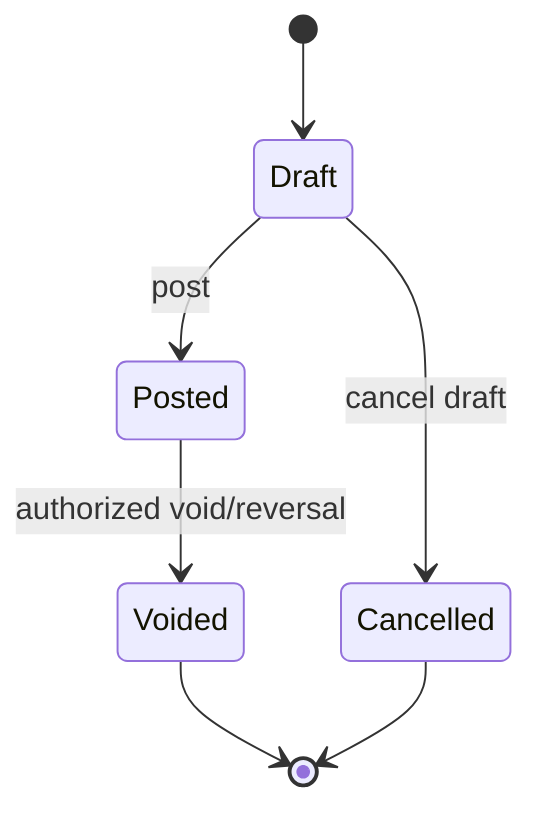
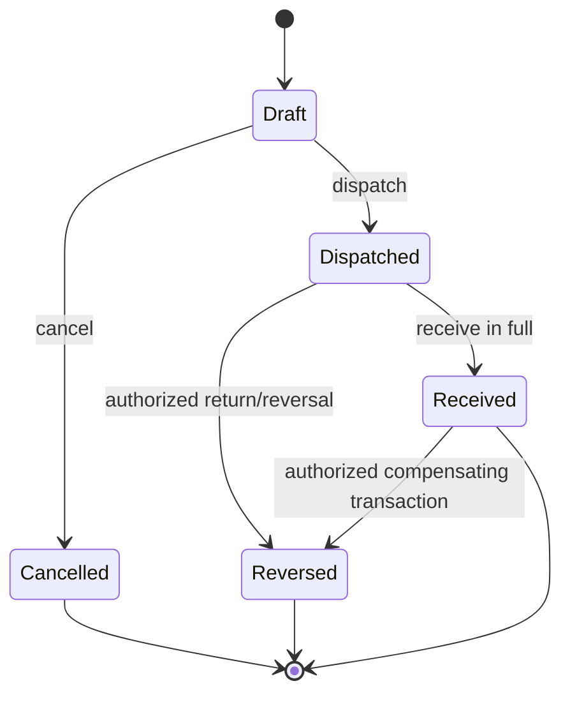
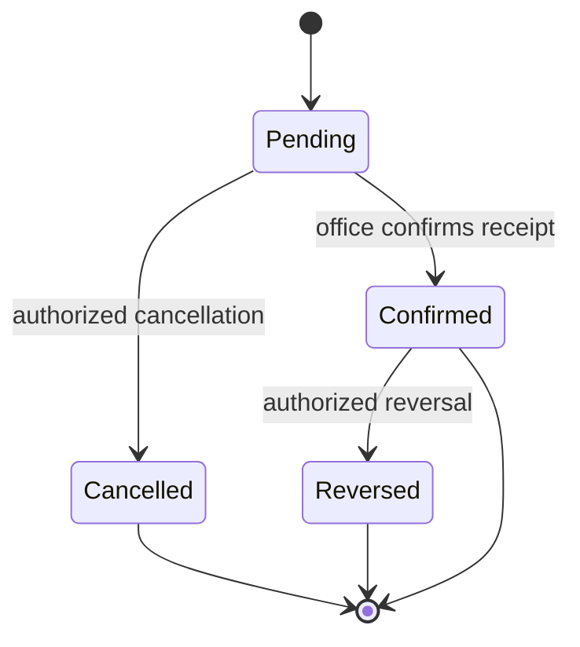
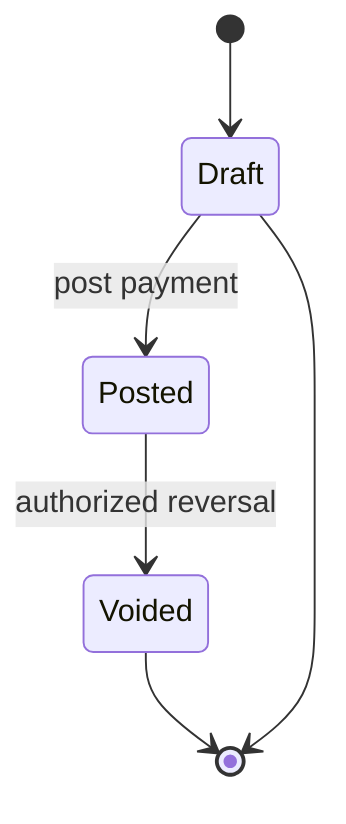

# Transaction State Machines

**Status:** Phase 0 baseline

Only named commands may change transaction status. Generic update endpoints cannot transition posted or dispatched documents.

## Stock import and sale

- Draft has no stock or financial effect.
- Posted applies all effects once and becomes immutable.
- Void creates compensating ledger entries and links to the original transaction.
- A void is rejected if reversal would violate a later balance invariant unless an approved corrective workflow handles it.

The SRS names only Draft, Posted, and Voided for imports/sales. `Cancelled` is an implementation status for abandoned drafts and has no ledger effect.

### Phase 5 sale refinement

Sales expose only Draft, Posted, and Voided. Draft headers and lines are editable through the representative's own route and have no stock or financial effect. Posting atomically deducts representative stock and increases exactly one of cash hold or customer outstanding credit. Posted sales have no generic update or delete path. Authorized void restores stock and appends the opposite financial delta; it never rewrites the original movements.

## Warehouse and representative transfers

- Draft has no stock effect.
- Dispatch locks source inventory, validates availability, deducts it, and establishes in-transit quantity.
- Representative dispatch also locks/rechecks current plus other incoming stock against the 100-unit product limit.
- Receipt is all-or-nothing in version 1.
- Receipt removes the in-transit position and increases the destination balance.
- Dispatched or received records are never deleted or reset to Draft.

## Cash submission

- Pending does not reduce representative cash hold.
- Confirmation locks the cash balance, rechecks the amount, and reduces cash hold once.
- A representative cannot confirm their own submission unless a future permission explicitly allows it.

## Customer payment

- Posting locks customer credit state and prevents outstanding credit from becoming negative.
- Version 1 rejects overpayment unless the provisional policy is replaced.
- A draft can be edited but has no generic delete route; posted and voided payments are immutable.
- Voiding requires independent permission and a reason, restores outstanding credit, and links the compensating ledger row to the original payment transaction.

## Command invariants

Every stock or financial command performs these operations atomically:

1. Authenticate the actor.
2. Authorize feature permission, scope, and ownership.
3. Claim or find the idempotency key.
4. Lock the document and relevant balance rows in deterministic order.
5. Revalidate state, quantities, limits, and current balances.
6. Apply document, balance, ledger, and audit changes.
7. Store the command result and commit.

Any exception rolls back every operation. Retrying the same completed key returns its recorded outcome rather than applying the command again.
